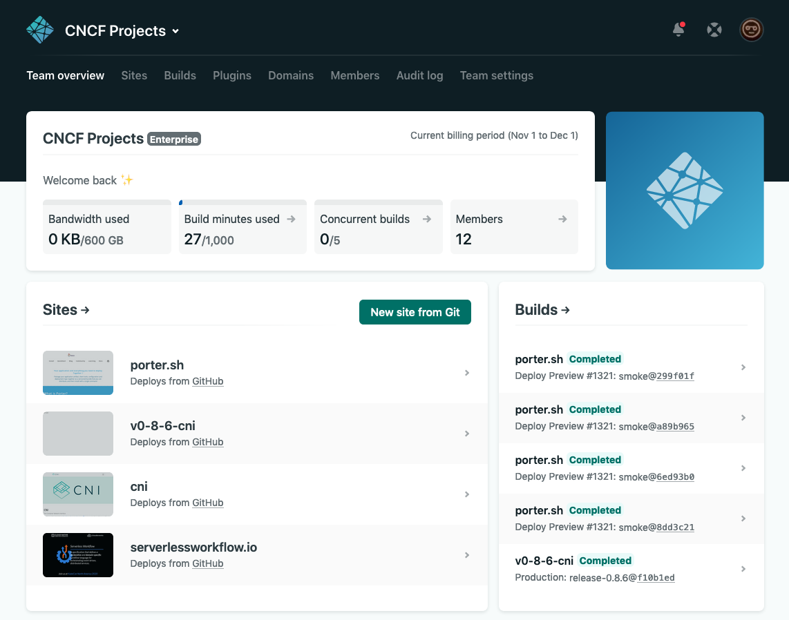
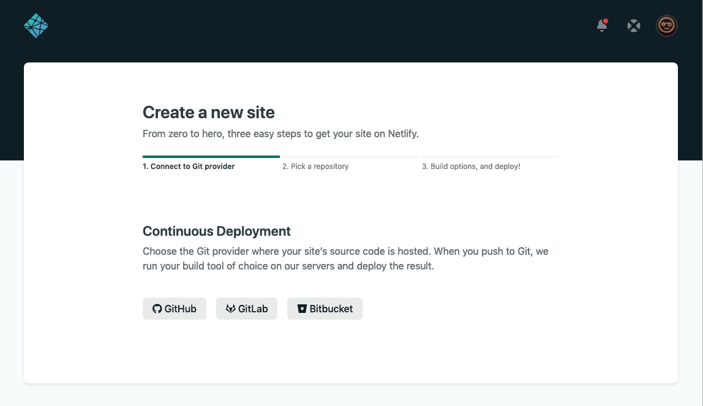
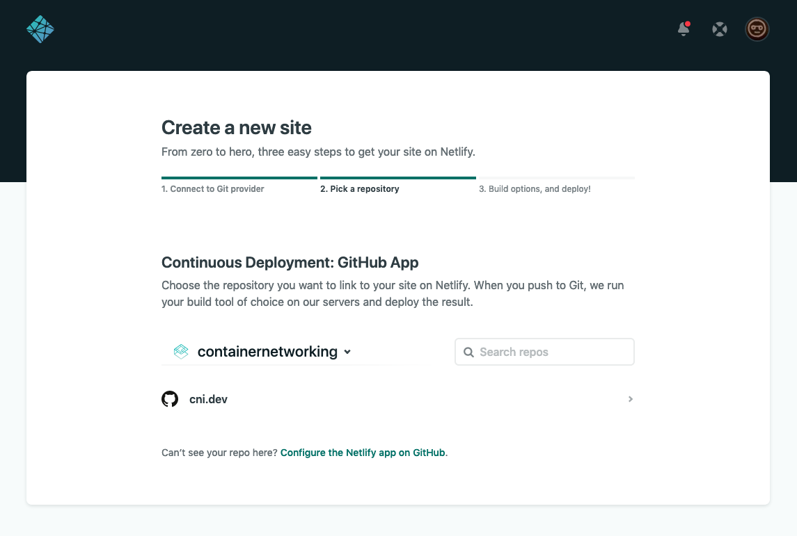
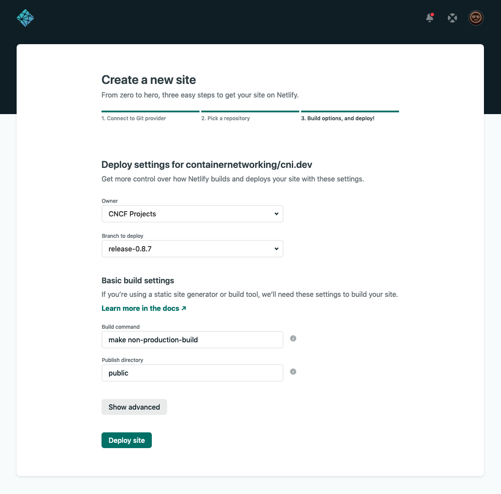
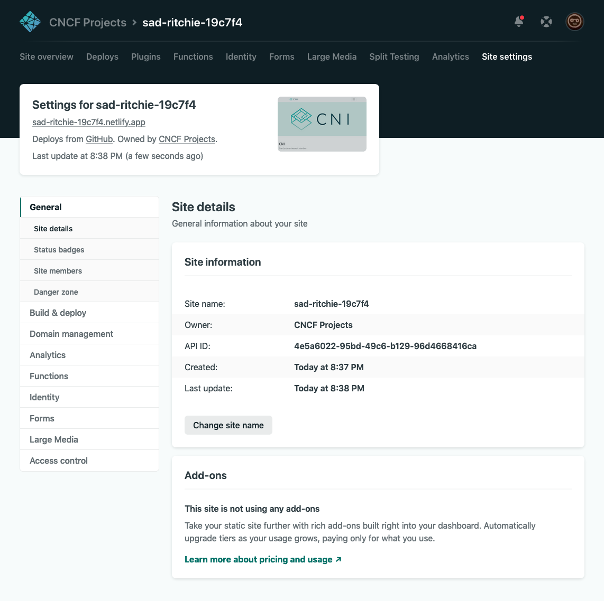
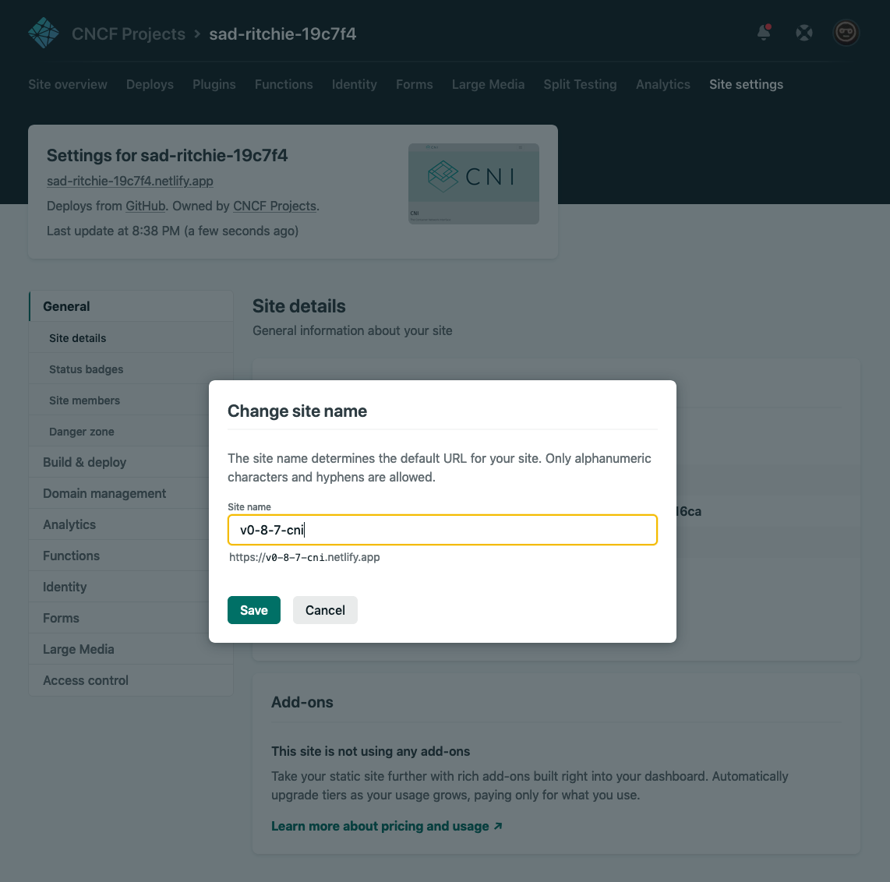

# CNCF Hugo Starter

This repository contains a boilerplate static site generator setup for creating CNCF documentation projects. We strongly recommend using this setup (it helps us help you and your project!), but none of the technologies in the stack are strictly required.

The starter uses the following:
* **[Hugo (extended, v0.73 or above)](https://gohugo.io/)** as a static site generator
* **[Bootstrap 4.5.x](https://getbootstrap.com/docs/4.5/getting-started/introduction/)** as a CSS framework
* **[Netlify](https://www.netlify.com/)** for building, hosting, and DNS management

## Running locally

Make sure you have [npm](https://www.npmjs.com/) and [yarn](https://yarnpkg.com/) installed. Clone this repository and run the following two commands in its directory:

```shell
# Install npm assets (just Bulma for Sass/CSS)
yarn

# Run the server locally
make serve
```

## Running on Netlify

Netlify is a CI/CD build tool and hosting solution for (among other things) static sites. We **strongly** recommend using Netlify unless you have a good reason not to.

This repository comes with a pre-configured [`netlify.toml`](https://github.com/cncf/hugo-netlify-starter/blob/master/netlify.toml) file. To build to Netlify:

1. Go to [netlify.com](https://netlify.com) and sign up. We recommend signing up using a GitHub account.
2. Click **New Site from Git**, and give Netlify access to your GitHub account.
  > **Note:** For projects with lots of contributors, it can be handy to create a general/bot account instead of granting access with a personal account.

3. Install Netlify with access to your documentation site repository.
4. Leave all other settings as default and click **Deploy Site**.

# What's included

This repository has two layouts with minimal styling, all stored under `/layouts/_default`:

* A **homepage** template, a basic homepage which uses the following:
  * The `index.html` file and partials in the `/partials/home` directory
  * Some helpers in the `/assets/sass/helpers.sass` file
* A **docs** template, a basic content page with submenu which uses the following:
  * The `single.html` file and partials in the `/partials/docs` directory
  * Classes in the `/assets/sass/helpers.sass` and `/assets/sass/_docs.sass` files

Both use default components and styling from the Bootstrap CSS framework. No menus are structured, because menu structure is highly dependent on the nature of the project.

# Versioning the CNI website

The current website version should always be one plus the [containernetworking/plugins](https://github.com/containernetworking/plugins) repo’s most recent version as the website is a continuously deployed and often updated version of the documentation. The main, current version of the site is always the most up to date version of the documentation.

## Creating a new version

To create a new version from the current main branch, the process is as follows.

For this example, v0.8.7 is the current main branch version, and will be frozen into its own version. The new version for the site’s main branch will be v0.8.8, but will be listed as `Current`.

### Create new branch & update version

Create a new branch from `main` in the form `release-x.x.x`

```bash
$ git checkout -b release-0.8.7
Switched to a new branch 'release-0.8.7'
```

Edit the `config.toml` file with the new `latest` version (v0.8.8).
Update the `docsbranch` to help people know where this version is going to reside.

If this version is now deprecated, set the `deprecated` flag to true to show the deprecation warning on the site.

Add a new `[[params.versions]]` with the newest current version.

Update the existing v0.8.7 `[[params.versions]]` for this version.

```toml
latest = "v0.8.7" # updated
latestUrl = "https://v0-8-7.cni.dev" # Updated

# Site information (i.e., the site currently being served. In this case, v0.8.7)
fullversion = "v0.8.7"
version = "v0.8.7"
docsbranch = "relese-0.8.7" # updated
deprecated = false

# Updated current version menu entry
[[params.versions]]
fullversion = "v0.8.8" # updated
version = "Current"
docsbranch = "master"
url = "https://www.cni.dev"

# New version v0.8.7 menu entry
[[params.versions]]
fullversion = "v0.8.7"
version = "v0.8.7"
docsbranch = "release-0.8.7"
url = "https://v0-8-7.cni.dev"
```

Commit and push new `release-0.8.7` branch upstream.

### Create new netlify site

Login at https://app.netlify.com
Select `CNCF Projects` team. 
- Note: If you don’t have access to this team, please contact __ __ at the CNCF to update team permissions.



Click the `New site from Git` button

#### Create a new site



Select `GitHub`

At “Continuous Deployment: GitHub App” prompt, select `containternetworking` project, then click `cni.dev`.



At the “Deploy settings for containernetworking/cni.dev” prompt, set the following
- Branch to deploy: `release-0.8.7`
- Build command: `make non-production-build`



Click `Deploy site`

### Site & domain settings

Once deployed, click `site settings` to change the site name.

Click change site name



Set site name: v0-8-7-cni
(this will update the URL as well)



The site is now deployed at https://v0-8-7-cni.netlify.app/, with correct entries in the “Versions” menu.

### DNS updates
TODO: update with instructions for DNS

### Update main branch with new version

In the `config.toml` file, update the `latest`, `fullversion` and `version`. Update the previous version’s prams.versions’ section `docsbranch` and `url`.

Add a new section for latest version, update the previous version’s `url` and `docsbranch`

```toml
latest = "v0.8.8"       # updated
latestUrl = "https://v0-8-7.cni.dev"

fullversion = "v0.8.8"  # updated
version = "v0.8.8"      # updated
docsbranch = "master"
deprecated = false

# Updated current version menu entry
[[params.versions]]
fullversion = "v0.8.8"  # updated
version = "v0.8.8"      # updated
docsbranch = "master"
url = "https://www.cni.dev"

# New version v0.8.7 menu entry
[[params.versions]]
fullversion = "v0.8.7"
version = "v0.8.7"
docsbranch = "release-0.8.7"
url = "https://v0-8-7.cni.dev"
```

### Update any old version branches that are still supported

In this case, we have v0.8.6 that we are still supporting, so we need to change the config in the release-0.8.6 branch. This way the current version is still reflected on the site, and there are links to all the supported versions in the dropdown menu.

```toml
# config.toml file in release-0.8.6 branch (partial)

latest = "v0.8.7"       # updated
latestUrl = "https://v0-8-7.cni.dev"

fullversion = "v0.8.6"
version = "v0.8.6"
docsbranch = "release-0.8.6"
deprecated = true

# Updated current version menu entry
[[params.versions]]
fullversion = "v0.8.8"  # updated
version = "v0.8.8"      # updated
docsbranch = "master"
url = "https://www.cni.dev"

# New version v0.8.7 menu entry
[[params.versions]]
fullversion = "v0.8.7"
version = "v0.8.7"
docsbranch = "release-0.8.7"
url = "https://v0-8-7.cni.dev"

# Existing version v0.8.6 menu entry
[[params.versions]]
fullversion = "v0.8.6"
version = "v0.8.6"
docsbranch = "release-0.8.6"
url = "https://v0-8-6.cni.dev"
```
